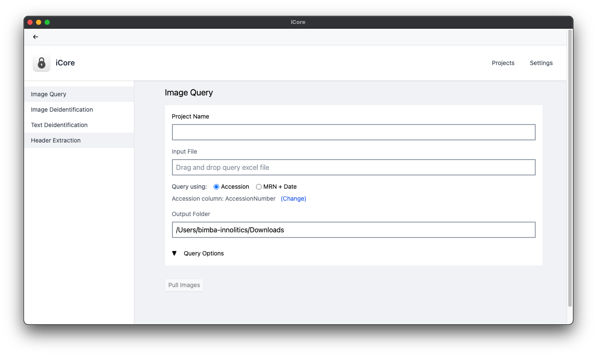

<p align="center"></p>

<p align="center"><b>iCore Image</b></p>

<p align="center"><a href="https://innolitics.notion.site/iCore-v0-0-7-User-Manual-160bd5b7a754804287bed990845636cd">Complete iCore User Guide</a></p>

<p align="center">Medical Image and Text De-identification Tool by St. Jude</p>

<p align="center"></p>

## Install Dependencies
Please install the following before running any make commands.
* Python 3.12 (virtual environment recommended)
* Node 20+

On Windows you additionally need PowerShell 7 (`pwsh`) and the Rust toolchain;
the `make` targets are POSIX-shell only, so use `scripts/build-windows.ps1`
instead (see [Build Windows App](#build-windows-app)).

Then install the dependencies.

```
make deps external-deps
```

## Running Development Build

```
make dev
```
Note: Electron uses Chromium to lauch the development build. It is recommended to clear the Chrome cache to avoid hanging of the application.

## Running Test Suite

```
make test
```

Note: you need docker installed and running (some tests set up an Orthanc server)

If you want to run the test suite in CI, trigger `Test Suite` workflow from Actions.

## Build macOS App

```
make
```

## Build Windows App

```
pwsh scripts/build-windows.ps1
```

Produces an unsigned NSIS installer in `electron/dist/`. The script is the
Windows counterpart to `make all` — it fetches DCMTK and rclone, builds the Rust
engine and the React QC viewer, freezes the Django app with PyInstaller, and
packages the installer.

Notes:

* **x64 only.** `uv.lock` has no `win_arm64` wheels for numpy, pandas,
  cryptography, blis or sqlalchemy, so an arm64 build cannot install its
  dependencies. Windows 11 on ARM runs the x64 build under emulation, which is
  what the bundled x64 DCMTK already relies on.
* **Unsigned.** There is no Authenticode certificate, so users see a SmartScreen
  warning on first run. Auto-update still works (electron-updater skips
  signature verification when no publisher name is configured).
* **App data lives in `%LOCALAPPDATA%\iCore`**, not `Documents`, so OneDrive's
  Known Folder Move cannot sync the sqlite databases or PHI working directories
  to the cloud.
* **Firewall.** The DICOM listener (`storescp`) binds port 50001. Windows
  Defender prompts for approval on first bind, which needs an administrator —
  the installer is per-user and does not elevate, so PACS retrieval may need a
  firewall rule added out of band.
* There is no `make dev` equivalent on Windows yet; see the plan's deferred work.
